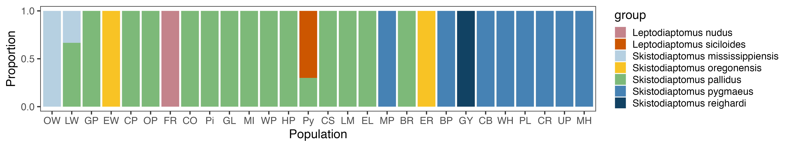
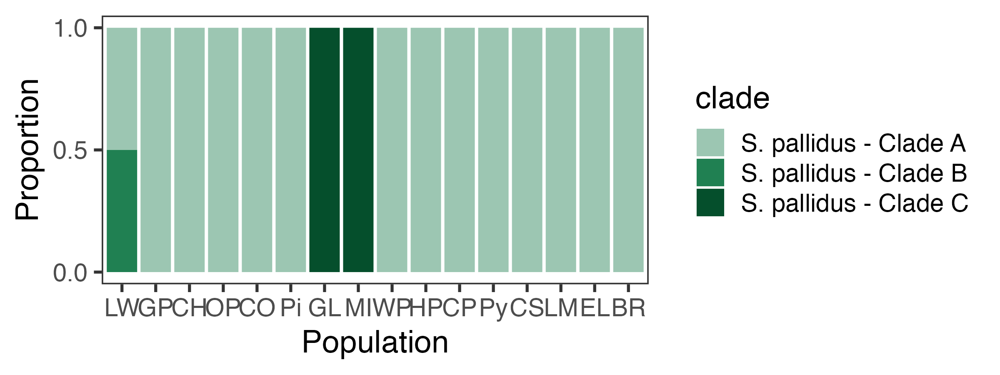
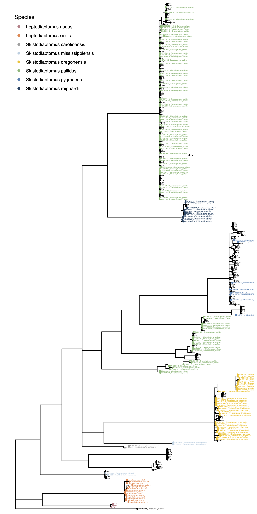

```{r setup, include=T, message = F, warning = F, echo = F}
knitr::opts_chunk$set(
  echo = knitr::is_html_output(),
  fig.align = "center",
  fig.path = "../Figures/markdown/",
  dev = c("png", "pdf"),
  message = FALSE,
  warning = FALSE,
  collapse = T
)

theme_matt = function(base_size = 18,
                      dark_text = "grey20"){
  mid_text <-  monochromeR::generate_palette(dark_text, "go_lighter", n_colours = 5)[2]
  light_text <-  monochromeR::generate_palette(dark_text, "go_lighter", n_colours = 5)[3]
  
  ggpubr::theme_pubr(base_family="sans") %+replace% 
    theme(
      panel.background  = element_rect(fill="transparent", colour=NA), 
      plot.background = element_rect(fill="transparent", colour=NA), 
      legend.background = element_rect(fill="transparent", colour=NA),
      legend.key = element_rect(fill="transparent", colour=NA),
      text = element_text(colour = mid_text, lineheight = 1.1),
      title = element_text(size = base_size * 1.5,
                           colour = dark_text),
      axis.text = element_text(size = base_size,
                               colour = mid_text),
      axis.title.x = element_text(size = base_size * 1.2,
                                  margin = unit(c(3, 0, 0, 0), "mm")),
      axis.title.y = element_text(size = base_size * 1.2,
                                  margin = unit(c(0, 5, 0, 0), "mm"), 
                                  angle = 90),
      legend.text = element_text(size=base_size * 0.9),
      legend.title = element_text(size = base_size * 0.9, 
                                  face = "bold"),
      plot.margin = margin(0.25, 0.25, 0.25, 0.25,"cm")
    )
}

theme_matt_facets = function(base_size = 18,
                             dark_text = "grey20"){
  mid_text <-  monochromeR::generate_palette(dark_text, "go_lighter", n_colours = 5)[2]
  light_text <-  monochromeR::generate_palette(dark_text, "go_lighter", n_colours = 5)[3]
  
  theme_bw(base_family="sans") %+replace% 
    theme(
      panel.grid = element_blank(),
      panel.background  = element_rect(fill="transparent", colour=NA), 
      plot.background = element_rect(fill="transparent", colour=NA), 
      legend.background = element_rect(fill="transparent", colour=NA),
      legend.key = element_rect(fill="transparent", colour=NA),
      text = element_text(colour = mid_text, lineheight = 1.1),
      strip.text.x = element_text(size = base_size),
      title = element_text(size = base_size * 1.5,
                           colour = dark_text),
      axis.text = element_text(size = base_size,
                               colour = mid_text),
      axis.title.x = element_text(size = base_size * 1.2,
                                  margin = unit(c(3, 0, 0, 0), "mm")),
      axis.title.y = element_text(size = base_size * 1.2,
                                  margin = unit(c(0, 5, 0, 0), "mm"), 
                                  angle = 90),
      legend.text = element_text(size=base_size * 0.9),
      legend.title = element_text(size = base_size * 0.9, 
                                  face = "bold"),
      plot.margin = margin(0.25, 0.25, 0.25, 0.25,"cm")
    )
}
```

## Site Map

```{r sampled-sites, fig.width=10, fig.height=6}
coords = ctmax_data %>%
  inner_join(site_data, by = c("site", "lat", "collection_temp")) %>% 
  dplyr::select(site, long, lat, collection_temp, elevation) %>%
  drop_na(collection_temp) %>% 
  distinct()

map_data("world") %>% 
  filter(region %in% c("USA", "Canada")) %>% 
  ggplot() + 
  geom_polygon(aes(x = long, y = lat, group = group),
               fill = "grey92", colour = "grey40", linewidth = 0.1) + 
  coord_map(xlim = c(-110,-60),
            ylim = c(25, 55)) + 
  geom_point(data = coords,
             mapping = aes(x = long, y = lat, colour = elevation),
             size = 3) +
  scale_colour_viridis_c(option = "G", direction = -1) + 
  labs(x = "Longitude", 
       y = "Latitude",
       colour = "Elev. (m)") + 
  theme_matt() + 
  theme(legend.position = "right")
```

## CTmax Data 

```{r fig.width=14, fig.height=10}
temp_lat_plot = ctmax_data %>% 
  ggplot(aes(x = lat, y = collection_temp)) + 
  geom_smooth(method = "lm", colour = "black") + 
  geom_point(size = 3) + 
  labs(x = "Latitude", 
       y = "Collection Temp. (°C)") + 
  theme_matt() + 
  theme(legend.position = "right")

ctmax_temp_plot = ctmax_data %>% 
  mutate(species = str_replace(species, "_", " "),
         species = str_to_sentence(species)) %>% 
  ggplot(aes(x = collection_temp, y = ctmax)) + 
  geom_smooth(method = "lm", colour = "black") + 
  geom_point(aes(colour = species), 
             size = 3) + 
  labs(x = "Collection Temp. (°C)", 
       y = "CTmax (°C)") + 
  scale_colour_manual(values = skisto_cols) + 
  theme_matt() + 
  theme(legend.position = "right")

ctmax_lat_plot = ctmax_data %>% 
  mutate(species = str_replace(species, "_", " "),
         species = str_to_sentence(species)) %>% 
  ggplot(aes(x = lat, y = ctmax)) + 
  geom_smooth(method = "lm", colour = "black") + 
  geom_point(aes(colour = species), 
             size = 3) + 
  labs(x = "Latitude", 
       y = "CTmax (°C)") + 
  scale_colour_manual(values = skisto_cols) + 
  theme_matt() + 
  theme(legend.position = "right")

ctmax_elev_plot = ctmax_data %>% 
  mutate(species = str_replace(species, "_", " "),
         species = str_to_sentence(species)) %>% 
  ggplot(aes(x = elevation, y = ctmax)) + 
  geom_smooth(method = "lm", colour = "black") + 
  geom_point(aes(colour = species), 
             size = 3) +
  labs(x = "Elevation (m)", 
       y = "CTmax (°C)") +
  scale_colour_manual(values = skisto_cols) + 
  theme_matt() + 
  theme(legend.position = "right")

ggpubr::ggarrange(temp_lat_plot, ctmax_temp_plot, ctmax_lat_plot, ctmax_elev_plot, common.legend = T, legend = "right", nrow = 2, ncol = 2, labels = "AUTO")
```

```{r fig.width=10, fig.height=7}
ctmax_data %>% 
  mutate(species = str_replace(species, "_", " "),
         species = str_to_sentence(species)) %>% 
  ggplot(aes(x = collection_temp, y = ctmax, colour = species)) + 
  facet_wrap(species~.) + 
  geom_smooth(method = "lm", colour = "black") + 
  geom_point() + 
  labs(x = "Collection Temp. (°C)",
       y = "CTmax (°C)") + 
  scale_color_manual(values = skisto_cols) + 
  theme_matt() + 
  theme(legend.position = "none")
```

```{r fig.width=10, fig.height=6}
ctmax_data %>% 
  filter(str_detect(species, pattern = "skisto") | 
           str_detect(species, pattern = "lepto") | 
           str_detect(species, pattern = "aglao")) %>% 
  mutate(species = str_replace(species, "_", " "),
         species = str_to_sentence(species)) %>% 
  group_by(collection_date, species, collection_temp) %>% 
  summarise(mean_ctmax = mean(ctmax),
            ctmax_sd = sd(ctmax),
            ctmax_n = n(), 
            ctmax_se = ctmax_sd / sqrt(ctmax_n)) %>% 
  ggplot(aes(x = collection_temp, y = mean_ctmax, colour = species)) + 
  geom_smooth(method = "lm", se=F, linewidth = 2) + 
  geom_point(size = 2) + 
  geom_errorbar(aes(ymin = mean_ctmax - ctmax_se, 
                    ymax = mean_ctmax + ctmax_se),
                width = 0.3, linewidth = 1) + 
  labs(x = "Collection Temp. (°C)",
       y = "CTmax (°C)") + 
  scale_colour_manual(values = skisto_cols) + 
  theme_matt() + 
  theme(legend.position = "right")
```

```{r fig.width=10, fig.height=7}
ctmax_data %>% 
  mutate(species = str_replace(species, "_", " "),
         species = str_to_sentence(species)) %>% 
  ggplot(aes(x = collection_temp, y = size, colour = species)) + 
  facet_wrap(species~.) + 
  geom_smooth(method = "lm", colour = "black") + 
  geom_point() + 
  labs(x = "Collection Temp. (°C)",
       y = "Prosome Length (mm)") + 
  scale_color_manual(values = skisto_cols) + 
  theme_matt() + 
  theme(legend.position = "none")
```

```{r fig.width=10, fig.height=7}
ctmax_data %>% 
  mutate(species = str_replace(species, "_", " "),
         species = str_to_sentence(species)) %>% 
  ggplot(aes(x = collection_temp, y = egg_volume, colour = species)) + 
  facet_wrap(species~.) + 
  geom_smooth(method = "lm", colour = "black") + 
  geom_point() + 
  labs(x = "Collection Temp. (°C)",
       y = "Egg Volume (mm^3)") + 
  scale_color_manual(values = skisto_cols) + 
  theme_matt() + 
  theme(legend.position = "none")
```

```{r}
ctmax_data %>% 
  select(elevation, collection_temp) %>% 
  distinct() %>% 
  ggplot(aes(x = elevation, y = collection_temp)) + 
  geom_point(size = 3) +
  labs(x = "Elevation (m)", 
       y = "Collection Temp. (°C)") + 
  theme_matt()
```

```{r fig.width=8, fig.height=7}
ctmax_data %>% 
  mutate(species = str_replace(species, "_", " "),
         species = str_to_sentence(species)) %>% 
  ggplot(aes(x = size, y = ctmax, colour = species)) + 
  facet_wrap(.~species) + 
  geom_point(size = 1) + 
  theme_matt() + 
  labs(x = "Length (mm)", 
       y = "CTmax (°C)") + 
  scale_colour_manual(values = skisto_cols) + 
  theme(legend.position = "none")
```

```{r fig.width=8, fig.height=7}
ctmax_data %>% 
  mutate(species = str_replace(species, "_", " "),
         species = str_to_sentence(species)) %>% 
  ggplot(aes(x = size, y = fecundity, colour = species)) + 
  facet_wrap(.~species) + 
  geom_point(size = 1) + 
  theme_matt() + 
  labs(x = "Length (mm)", 
       y = "Fecundity (# eggs)") + 
  scale_colour_manual(values = skisto_cols) + 
  theme(legend.position = "none")
```

```{r}
ggplot(ctmax_data, aes(x = size, y = total_egg_volume)) + 
  geom_smooth(method = "lm", formula = y ~ exp(x)) + 
  geom_point()+
  labs(x = "Prosome Length (mm)",
       y = "Total Egg Volume (mm^3)") + 
  theme_matt()

```

Data for just *Skistodiaptomus pallidus* is shown below. Point color is arranged according to latitude. 
```{r fig.width=8.5, fig.height=5.5}
ctmax_data %>% 
  filter(species == "skistodiaptomus_pallidus") %>%
  mutate(site = fct_reorder(site, lat, .desc = T)) %>% 
  # group_by(site) %>% 
  # summarise(size = mean(size, na.rm = T), 
  #          total_egg_volume = mean(total_egg_volume, na.rm = T)) %>% 
  ggplot(aes(x = size, y = total_egg_volume)) + 
  geom_smooth(method = "lm", formula = y ~ exp(x), 
              colour = "black") + 
  geom_point(aes(colour = site))+
  scale_color_viridis_d(direction = 1, 
                        option = "D") + 
  labs(x = "Prosome Length (mm)",
       y = "Total Egg Volume (mm^3)") + 
  theme_matt() + 
  theme(legend.position = "right")
```


```{r}
model_data = ctmax_data %>% 
  mutate("genus" = str_split_fixed(species, pattern = "_", n = 2)[,1],
         genus = tools::toTitleCase(genus),
         "doy" = yday(collection_date)) %>% 
  select(site, collection_date, doy, collection_temp, lat, elevation, species, genus, sample_id, fecundity, total_egg_volume, size, ctmax) %>% 
  filter(genus != "MH") %>%  
  mutate(total_egg_volume = if_else(is.na(total_egg_volume), 0, total_egg_volume),
         collection_temp_sc = scale(collection_temp),
         lat_sc = scale(lat), 
         elevation_sc = scale(elevation),
         tev_sc = scale(total_egg_volume)) 

ctmax_temp.model = lm(data = model_data, 
                      ctmax ~ genus + collection_temp + lat + elevation + total_egg_volume)

drop1(ctmax_temp.model, test = "F")

#MuMIn::dredge(ctmax_temp.model)

performance::check_model(ctmax_temp.model)

summary(ctmax_temp.model)

emmeans::emmeans(ctmax_temp.model, specs = "genus") %>% 
  data.frame() %>% 
  mutate(genus = fct_reorder(genus, .x = emmean, .desc = T)) %>% 
  ggplot(aes(genus, y = emmean)) + 
  geom_point(size = 4) + 
  geom_errorbar(aes(ymin = emmean - SE, ymax = emmean + SE), 
                width = 0.2, linewidth = 1) + 
  labs(x = "") + 
  theme_matt() + 
  theme(axis.text.x = element_text(angle = 300, hjust = 0, vjust = 0.5))

```


```{r fecundity-ridges, fig.width=8, fig.height=8}
ctmax_data %>% 
  mutate(group_id = paste(site, species)) %>% 
  ggplot(aes(x = fecundity, y = site, fill = site)) + 
  geom_density_ridges(bandwidth = 2,
                      jittered_points = TRUE, 
                      point_shape = 21,
                      point_size = 1,
                      point_colour = "grey30",
                      point_alpha = 0.6,
                      alpha = 0.9,
                      position = position_points_jitter(
                        height = 0.1, width = 0)) + 
  scale_fill_viridis_d(option = "D", direction = -1) + 
  theme_matt() + 
  theme(legend.position = "none")
```

```{r size-ridges, fig.width=8, fig.height=8}
ctmax_data %>% 
  mutate(group_id = paste(site, species)) %>% 
  ggplot(aes(x = size, y = site, fill = site, group = group_id)) + 
  geom_density_ridges(bandwidth = 0.02,
                      jittered_points = TRUE, 
                      point_shape = 21,
                      point_size = 1,
                      point_colour = "grey30",
                      point_alpha = 0.6,
                      alpha = 0.9,
                      position = position_points_jitter(
                        height = 0.1, width = 0)) + 
  scale_fill_viridis_d(option = "D", direction = -1) + 
  theme_matt() + 
  theme(legend.position = "none")
```

```{r ctmax-ridges, fig.width=8, fig.height=8}
ctmax_data %>% 
  mutate(group_id = paste(site, species)) %>% 
  ggplot(aes(x = ctmax, y = site, fill = site, group = group_id)) + 
  geom_density_ridges(bandwidth = 0.3,
                      jittered_points = TRUE, 
                      point_shape = 21,
                      point_size = 1,
                      point_colour = "grey30",
                      point_alpha = 0.6,
                      alpha = 0.9,
                      position = position_points_jitter(
                        height = 0.1, width = 0)) + 
  scale_fill_viridis_d(option = "D", direction = -1) + 
  labs(x = "CTmax (°C)") + 
  theme_matt() + 
  theme(legend.position = "none")
```

## COI Barcoding 

```{r, fig.align="center"}

```

```{r, fig.align="center"}

```

```{r, fig.align="center"}

```
