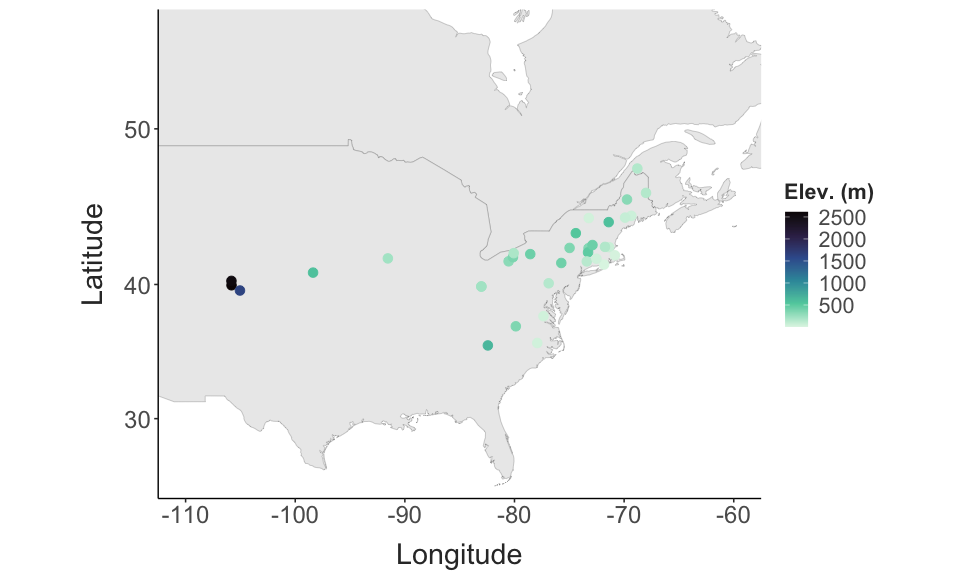
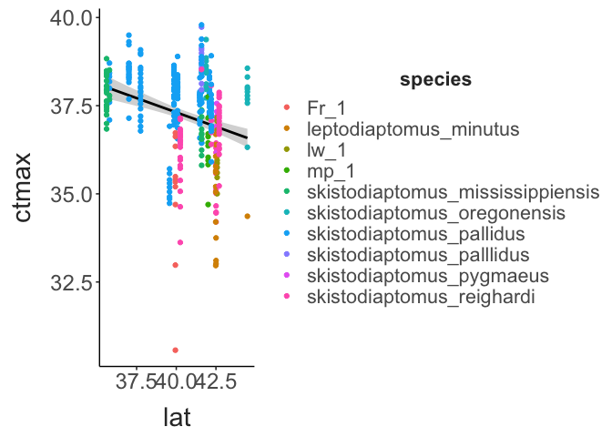
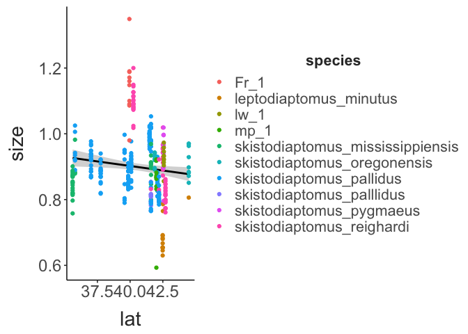
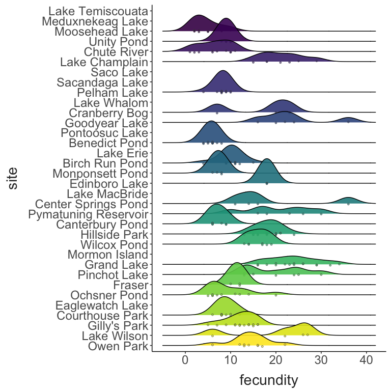

Diaptomid Thermal Limits
================
2024-08-01

- [Site Map](#site-map)

## Site Map

``` r
coords = site_data %>%
  dplyr::select(site, long, lat,trip) %>%
  distinct() 

map_data("world") %>% 
  filter(region %in% c("USA", "Canada")) %>% 
  ggplot() + 
  geom_polygon(aes(x = long, y = lat, group = group),
               fill = "lightgrey") + 
  coord_map(xlim = c(-110,-60),
            ylim = c(25, 55)) + 
  geom_point(data = coords,
             mapping = aes(x = long, y = lat, colour = trip),
             size = 3) +
  labs(x = "Longitude", 
       y = "Latitude",
       title = "Proposed Sites") + 
  theme_matt() + 
  theme(legend.position = "right")
```


``` r
coords = site_data %>%
  dplyr::select(site, long, lat, collection_temp) %>%
  drop_na(collection_temp) %>% 
  distinct()

map_data("world") %>% 
  filter(region %in% c("USA", "Canada")) %>% 
  ggplot() + 
  geom_polygon(aes(x = long, y = lat, group = group),
               fill = "lightgrey") + 
  coord_map(xlim = c(-110,-60),
            ylim = c(25, 55)) + 
  geom_point(data = coords,
             mapping = aes(x = long, y = lat, colour = collection_temp),
             size = 3) +
  scale_colour_viridis_c() + 
  labs(x = "Longitude", 
       y = "Latitude",
       colour = "Temp.",
       title = "Sampled Sites") + 
  theme_matt() + 
  theme(legend.position = "right")
```



``` r
ctmax_data %>% 
  ggplot(aes(x = collection_temp, y = ctmax)) + 
  geom_smooth(method = "lm", colour = "black") + 
  geom_point(aes(colour = species)) + 
  theme_matt() + 
  theme(legend.position = "right")
```


``` r

ctmax_data %>% 
  ggplot(aes(x = lat, y = ctmax)) + 
  geom_smooth(method = "lm", colour = "black") + 
  geom_point(aes(colour = species)) + 
  theme_matt() + 
  theme(legend.position = "right")
```



``` r
ctmax_data %>% 
  ggplot(aes(x = collection_temp, y = size)) + 
  geom_smooth(method = "lm", colour = "black") + 
  geom_point(aes(colour = species)) + 
  theme_matt() + 
  theme(legend.position = "right")
```


``` r

ctmax_data %>% 
  ggplot(aes(x = lat, y = size)) + 
  geom_smooth(method = "lm", colour = "black") + 
  geom_point(aes(colour = species)) + 
  theme_matt() + 
  theme(legend.position = "right")
```



``` r
ggplot(ctmax_data, aes(x = size, y = ctmax, colour = species)) + 
  geom_point() + 
  theme_matt() + 
  theme(legend.position = "right")
```


``` r
ctmax_data %>% 
  drop_na(fecundity) %>% 
ggplot(aes(x = fecundity, y = site, fill = site)) + 
  geom_density_ridges(bandwidth = 2,
                      jittered_points = TRUE, 
                      point_shape = 21,
                      point_size = 1,
                      point_colour = "grey30",
                      point_alpha = 0.6,
                      alpha = 0.9,
                      position = position_points_jitter(
                        height = 0.1, width = 0)) + 
  scale_fill_viridis_d(option = "E", direction = -1) + 
  theme_matt() + 
  theme(legend.position = "none")
```



``` r
ctmax_data %>% 
  mutate(group_id = paste(site, species)) %>% 
  ggplot(aes(x = size, y = site, fill = site, group = group_id)) + 
  geom_density_ridges(bandwidth = 0.02,
                      jittered_points = TRUE, 
                      point_shape = 21,
                      point_size = 1,
                      point_colour = "grey30",
                      point_alpha = 0.6,
                      alpha = 0.9,
                      position = position_points_jitter(
                        height = 0.1, width = 0)) + 
  scale_fill_viridis_d(option = "E", direction = -1) + 
  theme_matt() + 
  theme(legend.position = "none")
```


``` r
ctmax_data %>% 
  mutate(group_id = paste(site, species)) %>% 
  ggplot(aes(x = ctmax, y = site, fill = site, group = group_id)) + 
  geom_density_ridges(bandwidth = 0.3,
                      jittered_points = TRUE, 
                      point_shape = 21,
                      point_size = 1,
                      point_colour = "grey30",
                      point_alpha = 0.6,
                      alpha = 0.9,
                      position = position_points_jitter(
                        height = 0.1, width = 0)) + 
  scale_fill_viridis_d(option = "E", direction = -1) + 
  theme_matt() + 
  theme(legend.position = "none")
```


``` r
ctmax_data %>% 
  drop_na(species, size) %>% 
  mutate("ctmax_resid" = residuals(lm(data = ctmax_data, ctmax~collection_temp + species + site + size))) %>% 
  drop_na(fecundity) %>% 
  ggplot(aes(x = ctmax_resid, y = fecundity)) + 
  facet_wrap(species~.) + 
  geom_vline(xintercept = 0, colour = "grey") + 
  geom_point(aes(colour = species)) + 
  geom_smooth(aes(colour = species), method = "lm", se = F) + 
  scale_x_continuous(breaks = c(-0.5,0.5)) + 
  theme_matt_facets() + 
  theme(legend.position = "none")
```


