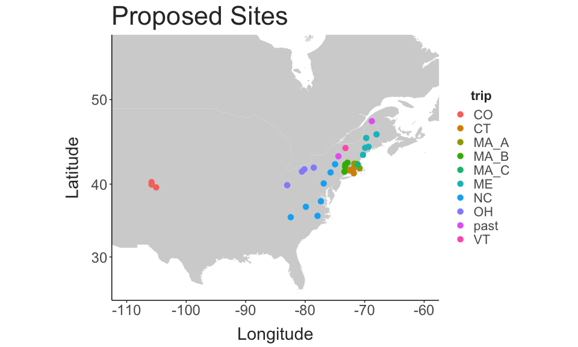

Diaptomid Thermal Limits
================
2024-05-19

- [Site Map](#site-map)

## Site Map

``` r
coords = site_data %>%
  dplyr::select(site, long, lat) %>%
  distinct()

map_data("world") %>% 
  filter(region %in% c("USA", "Canada")) %>% 
  ggplot() + 
  geom_polygon(aes(x = long, y = lat, group = group),
               fill = "lightgrey") + 
  coord_map(xlim = c(-85,-60),
            ylim = c(25, 48)) + 
  geom_point(data = coords,
             mapping = aes(x = long, y = lat, colour = site),
             size = 3) +
  labs(x = "Longitude", 
       y = "Latitude") + 
  theme_matt() + 
  theme(legend.position = "none")
```


