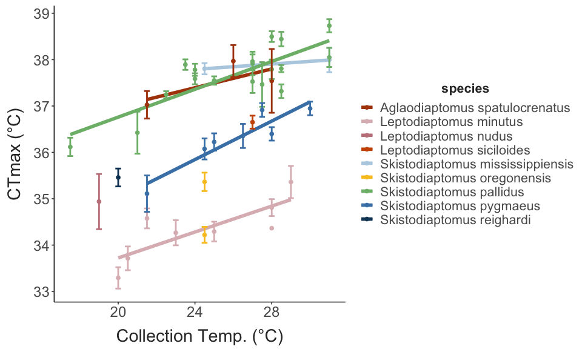
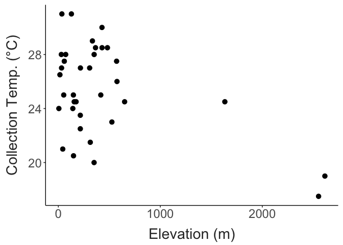
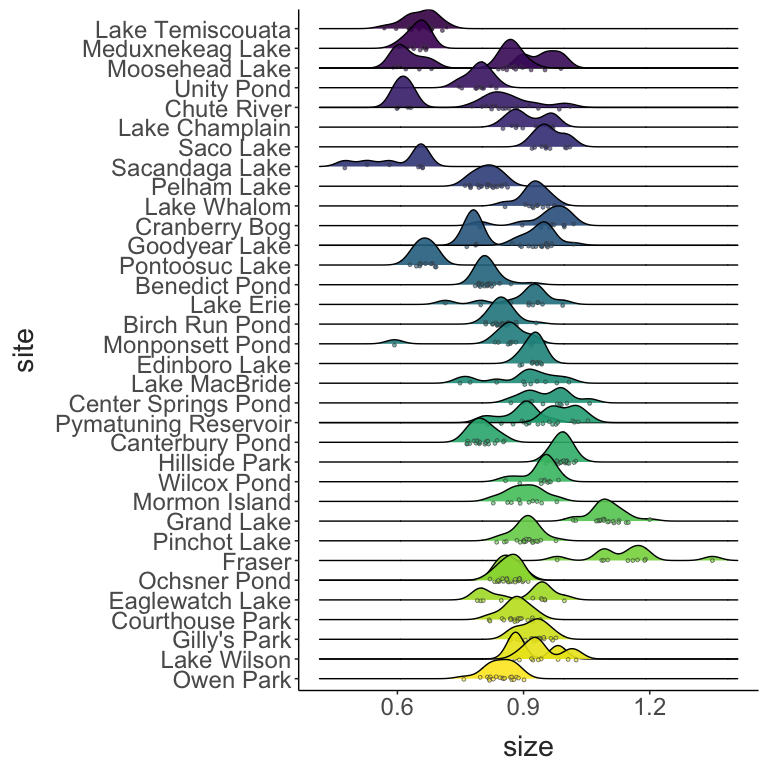
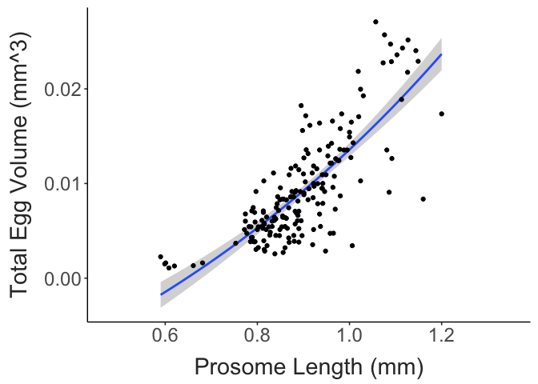

Diaptomid Thermal Limits
================
2024-08-25

- [Site Map](#site-map)
- [CTmax Data](#ctmax-data)

## Site Map

``` r
coords = site_data %>%
  dplyr::select(site, long, lat, collection_temp) %>%
  drop_na(collection_temp) %>% 
  distinct()

map_data("world") %>% 
  filter(region %in% c("USA", "Canada")) %>% 
  ggplot() + 
  geom_polygon(aes(x = long, y = lat, group = group),
               fill = "lightgrey") + 
  coord_map(xlim = c(-110,-60),
            ylim = c(25, 55)) + 
  geom_point(data = coords,
             mapping = aes(x = long, y = lat, colour = collection_temp),
             size = 3) +
  scale_colour_viridis_c(option = "F") + 
  labs(x = "Longitude", 
       y = "Latitude",
       colour = "Temp.") + 
  theme_matt() + 
  theme(legend.position = "right")
```


## CTmax Data

``` r
ctmax_temp_plot = ctmax_data %>% 
  mutate(species = str_replace(species, "_", " "),
         species = str_to_sentence(species)) %>% 
  ggplot(aes(x = collection_temp, y = ctmax)) + 
  geom_smooth(method = "lm", colour = "black") + 
  geom_point(aes(colour = species)) + 
  labs(x = "Collection Temp. (°C)", 
       y = "CTmax (°C)") + 
  scale_colour_manual(values = skisto_cols) + 
  theme_matt() + 
  theme(legend.position = "right")

ctmax_lat_plot = ctmax_data %>% 
  mutate(species = str_replace(species, "_", " "),
         species = str_to_sentence(species)) %>% 
  ggplot(aes(x = lat, y = ctmax)) + 
  geom_smooth(method = "lm", colour = "black") + 
  geom_point(aes(colour = species)) + 
   labs(x = "Latitude", 
       y = "CTmax (°C)") + 
  scale_colour_manual(values = skisto_cols) + 
  theme_matt() + 
  theme(legend.position = "right")

ctmax_elev_plot = ctmax_data %>% 
  mutate(species = str_replace(species, "_", " "),
         species = str_to_sentence(species)) %>% 
  ggplot(aes(x = elevation, y = ctmax)) + 
  geom_smooth(method = "lm", colour = "black") + 
  geom_point(aes(colour = species)) +
  labs(x = "Elevation (m)", 
       y = "CTmax (°C)") +
  scale_colour_manual(values = skisto_cols) + 
  theme_matt() + 
  theme(legend.position = "right")

ggpubr::ggarrange(ctmax_temp_plot, ctmax_lat_plot, ctmax_elev_plot, common.legend = T, legend = "right", nrow = 1)
```


``` r
ctmax_data %>% 
  filter(str_detect(species, pattern = "skisto") | 
           str_detect(species, pattern = "lepto")) %>% 
  mutate(species = str_replace(species, "_", " "),
         species = str_to_sentence(species)) %>% 
  ggplot(aes(x = collection_temp, y = ctmax)) + 
  facet_wrap(species~.) + 
  geom_smooth(method = "lm", colour = "black") + 
  geom_point() + 
  labs(x = "Collection Temp. (°C)",
       y = "CTmax (°C)") + 
  theme_matt() + 
  theme(legend.position = "none")
```


``` r
ctmax_data %>% 
  filter(str_detect(species, pattern = "skisto") | 
           str_detect(species, pattern = "lepto")) %>% 
  mutate(species = str_replace(species, "_", " "),
         species = str_to_sentence(species)) %>% 
  group_by(collection_date, species, collection_temp) %>% 
  summarise(mean_ctmax = mean(ctmax),
            ctmax_sd = sd(ctmax),
            ctmax_n = n(), 
            ctmax_se = ctmax_sd / sqrt(ctmax_n)) %>% 
  ggplot(aes(x = collection_temp, y = mean_ctmax, colour = species)) + 
  geom_smooth(method = "lm", se=F, linewidth = 2) + 
  geom_point(size = 2) + 
  geom_errorbar(aes(ymin = mean_ctmax - ctmax_se, 
                    ymax = mean_ctmax + ctmax_se),
                width = 0.3, linewidth = 1) + 
  labs(x = "Collection Temp. (°C)",
       y = "CTmax (°C)") + 
    scale_colour_manual(values = skisto_cols) + 
  theme_matt() + 
  theme(legend.position = "right")
```



``` r
ctmax_data %>% 
  mutate(species = str_replace(species, "_", " "),
         species = str_to_sentence(species)) %>% 
  ggplot(aes(x = collection_temp, y = size)) + 
  geom_smooth(method = "lm", colour = "black") + 
  geom_point(aes(colour = species)) + 
  labs(x = "Collection Temp. (°C)", 
       y = "Prosome Length (mm)") + 
  scale_colour_manual(values = skisto_cols) + 
  theme_matt() + 
  theme(legend.position = "right")
```


``` r
ctmax_data %>% 
  filter(str_detect(species, pattern = "skisto") | 
           str_detect(species, pattern = "lepto")) %>% 
  mutate(species = str_replace(species, "_", " "),
         species = str_to_sentence(species)) %>% 
  ggplot(aes(x = collection_temp, y = size)) + 
  facet_wrap(species~.) + 
  geom_smooth(method = "lm", colour = "black") + 
  geom_point() + 
  labs(x = "Collection Temp. (°C)",
       y = "Prosome Length (mm)") + 
  theme_matt() + 
  theme(legend.position = "none")
```


``` r
ctmax_data %>% 
  select(elevation, collection_temp) %>% 
  distinct() %>% 
ggplot(aes(x = elevation, y = collection_temp)) + 
  geom_point(size = 3) +
  labs(x = "Elevation (m)", 
       y = "Collection Temp. (°C)") + 
  theme_matt()
```



``` r
ggplot(ctmax_data, aes(x = size, y = ctmax, colour = species)) + 
  geom_point() + 
  theme_matt() + 
  theme(legend.position = "right")
```


``` r
ctmax_temp.model = lm(data = ctmax_data, 
                      ctmax ~ collection_temp)

ctmax_resids = residuals(ctmax_temp.model)

ctmax_data %>% 
  mutate("genus" = if_else(species %in% c("Fr_1", "leptodiaptomus_minutus"), "Leptodiaptomus", "Skistodiaptomus"), 
         ctmax_resids = ctmax_resids) %>% 
  ggplot(aes(x = genus, y = ctmax_resids)) + 
  geom_boxplot() + 
  geom_point(position = position_jitter(height = 0, width = 0.05)) + 
  labs(x = "", 
       y = "CTmax Residuals") + 
  theme_matt()
```


``` r
ctmax_data %>% 
  drop_na(fecundity) %>% 
ggplot(aes(x = fecundity, y = site, fill = site)) + 
  geom_density_ridges(bandwidth = 2,
                      jittered_points = TRUE, 
                      point_shape = 21,
                      point_size = 1,
                      point_colour = "grey30",
                      point_alpha = 0.6,
                      alpha = 0.9,
                      position = position_points_jitter(
                        height = 0.1, width = 0)) + 
  scale_fill_viridis_d(option = "E", direction = -1) + 
  theme_matt() + 
  theme(legend.position = "none")
```


``` r
ctmax_data %>% 
  mutate(group_id = paste(site, species)) %>% 
  ggplot(aes(x = size, y = site, fill = site, group = group_id)) + 
  geom_density_ridges(bandwidth = 0.02,
                      jittered_points = TRUE, 
                      point_shape = 21,
                      point_size = 1,
                      point_colour = "grey30",
                      point_alpha = 0.6,
                      alpha = 0.9,
                      position = position_points_jitter(
                        height = 0.1, width = 0)) + 
  scale_fill_viridis_d(option = "E", direction = -1) + 
  theme_matt() + 
  theme(legend.position = "none")
```



``` r
ctmax_data %>% 
  filter(str_detect(species, pattern = "skisto")) %>% 
  mutate(group_id = paste(site, species)) %>% 
  ggplot(aes(x = ctmax, y = site, fill = site, group = group_id)) + 
  geom_density_ridges(bandwidth = 0.3,
                      jittered_points = TRUE, 
                      point_shape = 21,
                      point_size = 1,
                      point_colour = "grey30",
                      point_alpha = 0.6,
                      alpha = 0.9,
                      position = position_points_jitter(
                        height = 0.1, width = 0)) + 
  scale_fill_viridis_d(option = "E", direction = -1) + 
  labs(x = "CTmax (°C)") + 
  theme_matt() + 
  theme(legend.position = "none")
```


``` r
ctmax_data %>% 
  drop_na(species, size) %>% 
  mutate("ctmax_resid" = residuals(lm(data = ctmax_data, ctmax~collection_temp + species + site + size))) %>% 
  drop_na(fecundity) %>% 
  ggplot(aes(x = ctmax_resid, y = fecundity)) + 
  facet_wrap(species~.) + 
  geom_vline(xintercept = 0, colour = "grey") + 
  geom_point(aes(colour = species)) + 
  geom_smooth(aes(colour = species), method = "lm", se = F) + 
  scale_x_continuous(breaks = c(-0.5,0.5)) + 
  theme_matt_facets() + 
  theme(legend.position = "none")
```


