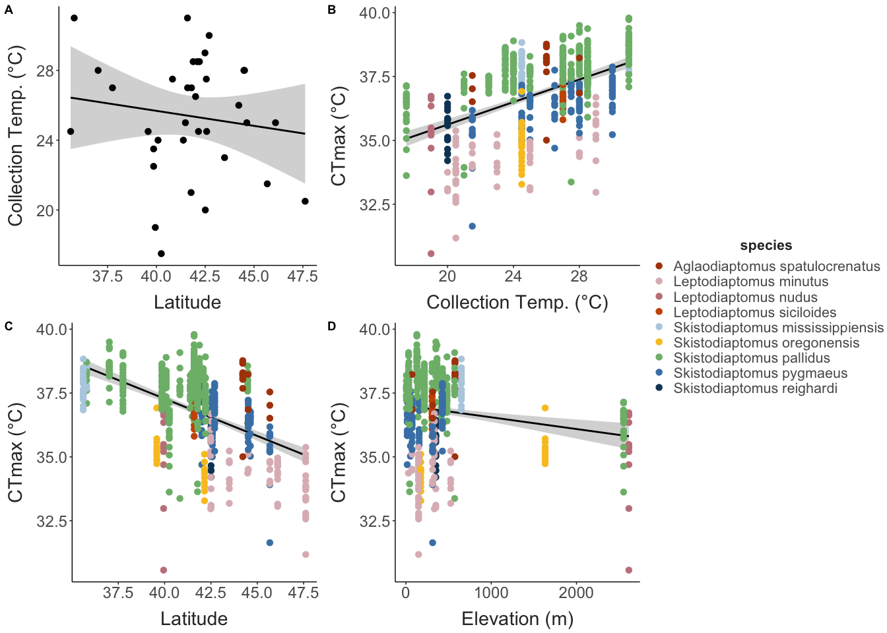
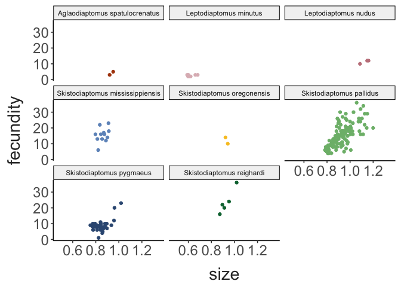
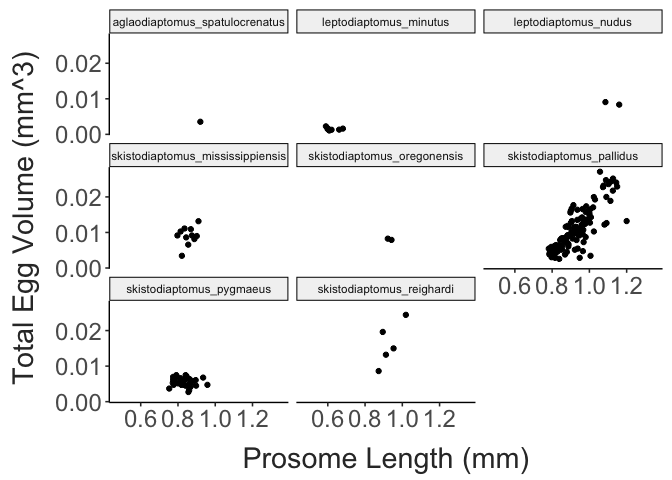
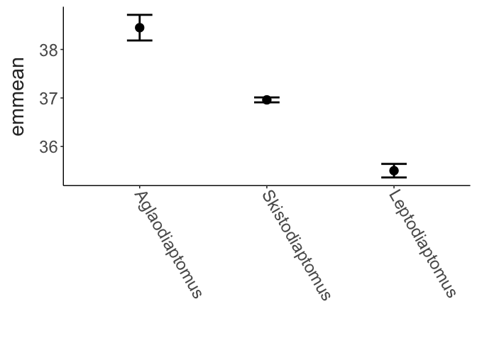

Diaptomid Thermal Limits
================
2024-09-12

- [Site Map](#site-map)
- [CTmax Data](#ctmax-data)

## Site Map

``` r
coords = site_data %>%
  dplyr::select(site, long, lat, collection_temp) %>%
  drop_na(collection_temp) %>% 
  distinct()

map_data("world") %>% 
  filter(region %in% c("USA", "Canada")) %>% 
  ggplot() + 
  geom_polygon(aes(x = long, y = lat, group = group),
               fill = "lightgrey") + 
  coord_map(xlim = c(-110,-60),
            ylim = c(25, 55)) + 
  geom_point(data = coords,
             mapping = aes(x = long, y = lat, colour = collection_temp),
             size = 3) +
  scale_colour_viridis_c(option = "F") + 
  labs(x = "Longitude", 
       y = "Latitude",
       colour = "Temp.") + 
  theme_matt() + 
  theme(legend.position = "right")
```


## CTmax Data

``` r
ctmax_temp_plot = ctmax_data %>% 
  mutate(species = str_replace(species, "_", " "),
         species = str_to_sentence(species)) %>% 
  ggplot(aes(x = collection_temp, y = ctmax)) + 
  geom_smooth(method = "lm", colour = "black") + 
  geom_point(aes(colour = species)) + 
  labs(x = "Collection Temp. (°C)", 
       y = "CTmax (°C)") + 
  scale_colour_manual(values = skisto_cols) + 
  theme_matt() + 
  theme(legend.position = "right")

ctmax_lat_plot = ctmax_data %>% 
  mutate(species = str_replace(species, "_", " "),
         species = str_to_sentence(species)) %>% 
  ggplot(aes(x = lat, y = ctmax)) + 
  geom_smooth(method = "lm", colour = "black") + 
  geom_point(aes(colour = species)) + 
  labs(x = "Latitude", 
       y = "CTmax (°C)") + 
  scale_colour_manual(values = skisto_cols) + 
  theme_matt() + 
  theme(legend.position = "right")

ctmax_elev_plot = ctmax_data %>% 
  mutate(species = str_replace(species, "_", " "),
         species = str_to_sentence(species)) %>% 
  ggplot(aes(x = elevation, y = ctmax)) + 
  geom_smooth(method = "lm", colour = "black") + 
  geom_point(aes(colour = species)) +
  labs(x = "Elevation (m)", 
       y = "CTmax (°C)") +
  scale_colour_manual(values = skisto_cols) + 
  theme_matt() + 
  theme(legend.position = "right")

ggpubr::ggarrange(ctmax_temp_plot, ctmax_lat_plot, ctmax_elev_plot, common.legend = T, legend = "right", nrow = 1)
```



``` r
ctmax_data %>% 
  mutate(species = str_replace(species, "_", " "),
         species = str_to_sentence(species)) %>% 
  ggplot(aes(x = collection_temp, y = ctmax)) + 
  facet_wrap(species~.) + 
  geom_smooth(method = "lm", colour = "black") + 
  geom_point() + 
  labs(x = "Collection Temp. (°C)",
       y = "CTmax (°C)") + 
  theme_matt() + 
  theme(legend.position = "none")
```


``` r
ctmax_data %>% 
  filter(str_detect(species, pattern = "skisto") | 
           str_detect(species, pattern = "lepto") | 
           str_detect(species, pattern = "aglao")) %>% 
  mutate(species = str_replace(species, "_", " "),
         species = str_to_sentence(species)) %>% 
  group_by(collection_date, species, collection_temp) %>% 
  summarise(mean_ctmax = mean(ctmax),
            ctmax_sd = sd(ctmax),
            ctmax_n = n(), 
            ctmax_se = ctmax_sd / sqrt(ctmax_n)) %>% 
  ggplot(aes(x = collection_temp, y = mean_ctmax, colour = species)) + 
  geom_smooth(method = "lm", se=F, linewidth = 2) + 
  geom_point(size = 2) + 
  geom_errorbar(aes(ymin = mean_ctmax - ctmax_se, 
                    ymax = mean_ctmax + ctmax_se),
                width = 0.3, linewidth = 1) + 
  labs(x = "Collection Temp. (°C)",
       y = "CTmax (°C)") + 
  scale_colour_manual(values = skisto_cols) + 
  theme_matt() + 
  theme(legend.position = "right")
```


``` r
ctmax_data %>% 
  mutate(species = str_replace(species, "_", " "),
         species = str_to_sentence(species)) %>% 
  ggplot(aes(x = collection_temp, y = size)) + 
  facet_wrap(species~.) + 
  geom_smooth(method = "lm", colour = "black") + 
  geom_point() + 
  labs(x = "Collection Temp. (°C)",
       y = "Prosome Length (mm)") + 
  theme_matt() + 
  theme(legend.position = "none")
```


``` r
ctmax_data %>% 
  mutate(species = str_replace(species, "_", " "),
         species = str_to_sentence(species)) %>% 
  ggplot(aes(x = collection_temp, y = egg_volume)) + 
  facet_wrap(species~.) + 
  geom_smooth(method = "lm", colour = "black") + 
  geom_point() + 
  labs(x = "Collection Temp. (°C)",
       y = "Egg Volume (mm^3)") + 
  theme_matt() + 
  theme(legend.position = "none")
```


``` r
ctmax_data %>% 
  select(elevation, collection_temp) %>% 
  distinct() %>% 
  ggplot(aes(x = elevation, y = collection_temp)) + 
  geom_point(size = 3) +
  labs(x = "Elevation (m)", 
       y = "Collection Temp. (°C)") + 
  theme_matt()
```


``` r
ggplot(ctmax_data, aes(x = size, y = ctmax, colour = species)) + 
  facet_wrap(.~species) + 
  geom_point() + 
  theme_matt() + 
  theme(legend.position = "none")
```


``` r

ggplot(ctmax_data, aes(x = size, y = fecundity, colour = species)) + 
  facet_wrap(.~species) + 
  geom_point() + 
  theme_matt() + 
  theme(legend.position = "none")
```



``` r
ggplot(ctmax_data, aes(x = size, y = total_egg_volume)) + 
  geom_smooth(method = "lm", formula = y ~ exp(x)) + 
  geom_point()+
  labs(x = "Prosome Length (mm)",
       y = "Total Egg Volume (mm^3)") + 
  theme_matt()
```


``` r

ggplot(ctmax_data, aes(x = size, y = total_egg_volume)) + 
  facet_wrap(.~species) + 
  geom_point()+
  #geom_smooth() + 
  labs(x = "Prosome Length (mm)",
       y = "Total Egg Volume (mm^3)") + 
  theme_matt()
```



``` r
ctmax_data %>% 
  filter(species == "skistodiaptomus_pallidus") %>%
  # group_by(site) %>% 
  # summarise(size = mean(size, na.rm = T), 
  #          total_egg_volume = mean(total_egg_volume, na.rm = T)) %>% 
ggplot(aes(x = size, y = total_egg_volume)) + 
  geom_smooth(method = "lm", formula = y ~ exp(x), 
              colour = "black") + 
  geom_point(aes(colour = site))+
  labs(x = "Prosome Length (mm)",
       y = "Total Egg Volume (mm^3)") + 
  theme_matt() + 
  theme(legend.position = "right")
```


``` r
model_data = ctmax_data %>% 
  mutate("genus" = str_split_fixed(species, pattern = "_", n = 2)[,1],
         genus = tools::toTitleCase(genus),
         "doy" = yday(collection_date)) %>% 
  select(site, collection_date, doy, collection_temp, lat, elevation, species, genus, sample_id, fecundity, total_egg_volume, size, ctmax) %>% 
  filter(genus != "MH") %>%  
  mutate(total_egg_volume = if_else(is.na(total_egg_volume), 0, total_egg_volume),
         collection_temp_sc = scale(collection_temp),
         lat_sc = scale(lat), 
         elevation_sc = scale(elevation),
         tev_sc = scale(total_egg_volume)) 

ctmax_temp.model = lm(data = model_data, 
                      ctmax ~ genus + collection_temp + lat + elevation + total_egg_volume)

#MuMIn::dredge(ctmax_temp.model)

performance::check_model(ctmax_temp.model)
```


``` r
 
summary(ctmax_temp.model)
## 
## Call:
## lm(formula = ctmax ~ genus + collection_temp + lat + elevation + 
##     total_egg_volume, data = model_data)
## 
## Residuals:
##     Min      1Q  Median      3Q     Max 
## -3.8997 -0.4819  0.0975  0.5955  2.5533 
## 
## Coefficients:
##                        Estimate Std. Error t value Pr(>|t|)    
## (Intercept)          43.1084072  1.0485289  41.113  < 2e-16 ***
## genusLeptodiaptomus  -3.1086251  0.3240655  -9.593  < 2e-16 ***
## genusSkistodiaptomus -1.5305123  0.3046859  -5.023 7.47e-07 ***
## collection_temp       0.1464862  0.0157380   9.308  < 2e-16 ***
## lat                  -0.1994596  0.0189392 -10.532  < 2e-16 ***
## elevation            -0.0002449  0.0000911  -2.688  0.00747 ** 
## total_egg_volume     33.6408738  8.1880105   4.109 4.77e-05 ***
## ---
## Signif. codes:  0 '***' 0.001 '**' 0.01 '*' 0.05 '.' 0.1 ' ' 1
## 
## Residual standard error: 0.9213 on 428 degrees of freedom
## Multiple R-squared:  0.5743, Adjusted R-squared:  0.5684 
## F-statistic: 96.24 on 6 and 428 DF,  p-value: < 2.2e-16

emmeans::emmeans(ctmax_temp.model, specs = "genus") %>% 
  data.frame() %>% 
  mutate(genus = fct_reorder(genus, .x = emmean, .desc = T)) %>% 
  ggplot(aes(genus, y = emmean)) + 
  geom_point(size = 4) + 
  geom_errorbar(aes(ymin = emmean - SE, ymax = emmean + SE), 
                width = 0.2, linewidth = 1) + 
  labs(x = "") + 
  theme_matt() + 
  theme(axis.text.x = element_text(angle = 300, hjust = 0, vjust = 0.5))
```



``` r
ctmax_data %>% 
  mutate(group_id = paste(site, species)) %>% 
  ggplot(aes(x = fecundity, y = site, fill = site)) + 
  geom_density_ridges(bandwidth = 2,
                      jittered_points = TRUE, 
                      point_shape = 21,
                      point_size = 1,
                      point_colour = "grey30",
                      point_alpha = 0.6,
                      alpha = 0.9,
                      position = position_points_jitter(
                        height = 0.1, width = 0)) + 
  scale_fill_viridis_d(option = "E", direction = -1) + 
  theme_matt() + 
  theme(legend.position = "none")
```


``` r
ctmax_data %>% 
  mutate(group_id = paste(site, species)) %>% 
  ggplot(aes(x = size, y = site, fill = site, group = group_id)) + 
  geom_density_ridges(bandwidth = 0.02,
                      jittered_points = TRUE, 
                      point_shape = 21,
                      point_size = 1,
                      point_colour = "grey30",
                      point_alpha = 0.6,
                      alpha = 0.9,
                      position = position_points_jitter(
                        height = 0.1, width = 0)) + 
  scale_fill_viridis_d(option = "E", direction = -1) + 
  theme_matt() + 
  theme(legend.position = "none")
```


``` r
ctmax_data %>% 
  mutate(group_id = paste(site, species)) %>% 
  ggplot(aes(x = ctmax, y = site, fill = site, group = group_id)) + 
  geom_density_ridges(bandwidth = 0.3,
                      jittered_points = TRUE, 
                      point_shape = 21,
                      point_size = 1,
                      point_colour = "grey30",
                      point_alpha = 0.6,
                      alpha = 0.9,
                      position = position_points_jitter(
                        height = 0.1, width = 0)) + 
  scale_fill_viridis_d(option = "E", direction = -1) + 
  labs(x = "CTmax (°C)") + 
  theme_matt() + 
  theme(legend.position = "none")
```


