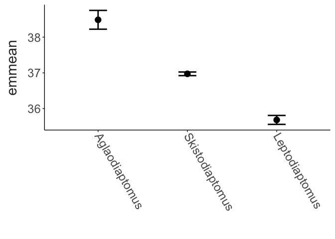
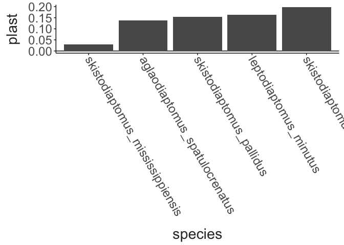
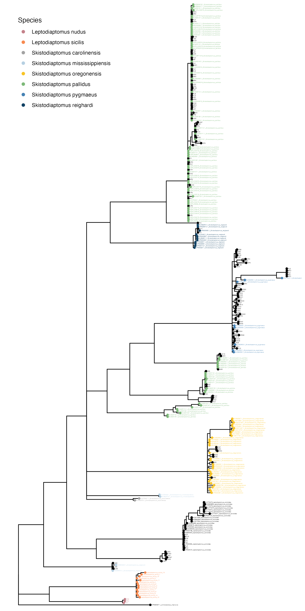

Diaptomid Thermal Limits
================
2025-11-12

- [Site Map](#site-map)
- [CTmax Data](#ctmax-data)
- [F3 CTmax data](#f3-ctmax-data)
- [High throughput size
  measurements](#high-throughput-size-measurements)
- [COI Barcoding](#coi-barcoding)

## Site Map

``` r
coords = ctmax_data %>%
  inner_join(site_data, by = c("site", "lat", "collection_temp")) %>% 
  dplyr::select(site, long, lat, collection_temp, elevation) %>%
  drop_na(collection_temp) %>% 
  distinct()

map_data("world") %>% 
  filter(region %in% c("USA", "Canada")) %>% 
  ggplot() + 
  geom_polygon(aes(x = long, y = lat, group = group),
               fill = "grey92", colour = "grey40", linewidth = 0.1) + 
  coord_map(xlim = c(-110,-60),
            ylim = c(25, 55)) + 
  geom_point(data = coords,
             mapping = aes(x = long, y = lat, colour = elevation),
             size = 3) +
  scale_colour_viridis_c(option = "G", direction = -1) + 
  labs(x = "Longitude", 
       y = "Latitude",
       colour = "Elev. (m)") + 
  theme_matt() + 
  theme(legend.position = "right")
```


## CTmax Data

``` r
temp_lat_plot = ctmax_data %>% 
  select(lat, collection_temp) %>% 
  distinct() %>% 
  ggplot(aes(x = lat, y = collection_temp)) + 
  geom_smooth(method = "lm", colour = "black") + 
  geom_point(size = 3) + 
  labs(x = "Latitude", 
       y = "Collection Temp. (°C)") + 
  theme_matt() + 
  theme(legend.position = "right")

ctmax_temp_plot = ctmax_data %>% 
  mutate(species = str_replace(species, "_", " "),
         species = str_to_sentence(species)) %>% 
  ggplot(aes(x = collection_temp, y = ctmax)) + 
  geom_smooth(method = "lm", colour = "black") + 
  geom_point(aes(colour = species), 
             size = 3) + 
  labs(x = "Collection Temp. (°C)", 
       y = "CTmax (°C)") + 
  scale_colour_manual(values = skisto_cols) + 
  theme_matt() + 
  theme(legend.position = "right")

ctmax_lat_plot = ctmax_data %>% 
  mutate(species = str_replace(species, "_", " "),
         species = str_to_sentence(species)) %>% 
  ggplot(aes(x = lat, y = ctmax)) + 
  geom_smooth(method = "lm", colour = "black") + 
  geom_point(aes(colour = species), 
             size = 3) + 
  labs(x = "Latitude", 
       y = "CTmax (°C)") + 
  scale_colour_manual(values = skisto_cols) + 
  theme_matt() + 
  theme(legend.position = "right")

ctmax_elev_plot = ctmax_data %>% 
  mutate(species = str_replace(species, "_", " "),
         species = str_to_sentence(species)) %>% 
  ggplot(aes(x = elevation, y = ctmax)) + 
  geom_smooth(method = "lm", colour = "black") + 
  geom_point(aes(colour = species), 
             size = 3) +
  labs(x = "Elevation (m)", 
       y = "CTmax (°C)") +
  scale_colour_manual(values = skisto_cols) + 
  theme_matt() + 
  theme(legend.position = "right")

ggpubr::ggarrange(temp_lat_plot, ctmax_temp_plot, ctmax_lat_plot, ctmax_elev_plot, common.legend = T, legend = "right", nrow = 2, ncol = 2, labels = "AUTO")
```


``` r
ctmax_data %>% 
  mutate(species = str_replace(species, "_", " "),
         species = str_to_sentence(species)) %>% 
  ggplot(aes(x = collection_temp, y = ctmax, colour = species)) + 
  facet_wrap(species~.) + 
  geom_smooth(method = "lm", colour = "black") + 
  geom_point() + 
  labs(x = "Collection Temp. (°C)",
       y = "CTmax (°C)") + 
  scale_color_manual(values = skisto_cols) + 
  theme_matt() + 
  theme(legend.position = "none")
```


``` r
ctmax_data %>% 
  filter(str_detect(species, pattern = "skisto") | 
           str_detect(species, pattern = "lepto") | 
           str_detect(species, pattern = "aglao")) %>% 
  mutate(species = str_replace(species, "_", " "),
         species = str_to_sentence(species)) %>% 
  group_by(collection_date, species, collection_temp) %>% 
  summarise(mean_ctmax = mean(ctmax),
            ctmax_sd = sd(ctmax),
            ctmax_n = n(), 
            ctmax_se = ctmax_sd / sqrt(ctmax_n)) %>% 
  ggplot(aes(x = collection_temp, y = mean_ctmax, colour = species)) + 
  geom_smooth(method = "lm", se=F, linewidth = 2) + 
  geom_point(size = 2) + 
  geom_errorbar(aes(ymin = mean_ctmax - ctmax_se, 
                    ymax = mean_ctmax + ctmax_se),
                width = 0.3, linewidth = 1) + 
  labs(x = "Collection Temp. (°C)",
       y = "CTmax (°C)") + 
  scale_colour_manual(values = skisto_cols) + 
  theme_matt() + 
  theme(legend.position = "right")
```


``` r
ctmax_data %>% 
  mutate(species = str_replace(species, "_", " "),
         species = str_to_sentence(species)) %>% 
  ggplot(aes(x = collection_temp, y = size, colour = species)) + 
  facet_wrap(species~.) + 
  geom_smooth(method = "lm", colour = "black") + 
  geom_point() + 
  labs(x = "Collection Temp. (°C)",
       y = "Prosome Length (mm)") + 
  scale_color_manual(values = skisto_cols) + 
  theme_matt() + 
  theme(legend.position = "none")
```


``` r
ctmax_data %>% 
  mutate(species = str_replace(species, "_", " "),
         species = str_to_sentence(species)) %>% 
  ggplot(aes(x = collection_temp, y = egg_volume, colour = species)) + 
  facet_wrap(species~.) + 
  geom_smooth(method = "lm", colour = "black") + 
  geom_point() + 
  labs(x = "Collection Temp. (°C)",
       y = "Egg Volume (mm^3)") + 
  scale_color_manual(values = skisto_cols) + 
  theme_matt() + 
  theme(legend.position = "none")
```


``` r
ctmax_data %>% 
  select(elevation, collection_temp) %>% 
  distinct() %>% 
  ggplot(aes(x = elevation, y = collection_temp)) + 
  geom_point(size = 3) +
  labs(x = "Elevation (m)", 
       y = "Collection Temp. (°C)") + 
  theme_matt()
```


``` r
ctmax_data %>% 
  mutate(species = str_replace(species, "_", " "),
         species = str_to_sentence(species)) %>% 
  ggplot(aes(x = size, y = ctmax, colour = species)) + 
  #facet_wrap(.~species) + 
  geom_point(size = 1) + 
  theme_matt() + 
  labs(x = "Length (mm)", 
       y = "CTmax (°C)") + 
  scale_colour_manual(values = skisto_cols) + 
  theme(legend.position = "none")
```


``` r
ctmax_data %>% 
  mutate(species = str_replace(species, "_", " "),
         species = str_to_sentence(species)) %>% 
  ggplot(aes(x = size, y = fecundity, colour = species)) + 
  facet_wrap(.~species) + 
  geom_point(size = 1) + 
  theme_matt() + 
  labs(x = "Length (mm)", 
       y = "Fecundity (# eggs)") + 
  scale_colour_manual(values = skisto_cols) + 
  theme(legend.position = "none")
```


``` r
ggplot(ctmax_data, aes(x = size, y = total_egg_volume)) + 
  geom_smooth(method = "lm", formula = y ~ exp(x)) + 
  geom_point()+
  labs(x = "Prosome Length (mm)",
       y = "Total Egg Volume (mm^3)") + 
  theme_matt()
```


Data for just *Skistodiaptomus pallidus* is shown below. Point color is
arranged according to latitude.

``` r
ctmax_data %>% 
  filter(species == "skistodiaptomus_pallidus") %>%
  mutate(site = fct_reorder(site, lat, .desc = T)) %>% 
  # group_by(site) %>% 
  # summarise(size = mean(size, na.rm = T), 
  #          total_egg_volume = mean(total_egg_volume, na.rm = T)) %>% 
  ggplot(aes(x = size, y = total_egg_volume)) + 
  geom_smooth(method = "lm", formula = y ~ exp(x), 
              colour = "black") + 
  geom_point(aes(colour = site))+
  scale_color_viridis_d(direction = 1, 
                        option = "D") + 
  labs(x = "Prosome Length (mm)",
       y = "Total Egg Volume (mm^3)") + 
  theme_matt() + 
  theme(legend.position = "right")
```


``` r
model_data = ctmax_data %>% 
  mutate("genus" = str_split_fixed(species, pattern = "_", n = 2)[,1],
         genus = tools::toTitleCase(genus),
         "doy" = yday(collection_date)) %>% 
  select(site, collection_date, doy, collection_temp, lat, elevation, species, genus, sample_id, fecundity, total_egg_volume, size, ctmax) %>% 
  filter(genus != "MH") %>%  
  mutate(total_egg_volume = if_else(is.na(total_egg_volume), 0, total_egg_volume),
         collection_temp_sc = scale(collection_temp),
         lat_sc = scale(lat), 
         elevation_sc = scale(elevation),
         tev_sc = scale(total_egg_volume)) 

ctmax_overall.model = lm(data = model_data, 
                      ctmax ~ genus + collection_temp + lat + elevation + total_egg_volume)

drop1(ctmax_overall.model, test = "F")
## Single term deletions
## 
## Model:
## ctmax ~ genus + collection_temp + lat + elevation + total_egg_volume
##                  Df Sum of Sq    RSS     AIC  F value    Pr(>F)    
## <none>                        485.97  -4.365                       
## genus             2   138.079 624.04 117.677  70.6070 < 2.2e-16 ***
## collection_temp   1   105.341 591.31  92.519 107.7332 < 2.2e-16 ***
## lat               1   113.236 599.20  99.203 115.8076 < 2.2e-16 ***
## elevation         1     6.509 492.48   0.341   6.6572   0.01016 *  
## total_egg_volume  1    21.484 507.45  15.438  21.9722 3.578e-06 ***
## ---
## Signif. codes:  0 '***' 0.001 '**' 0.01 '*' 0.05 '.' 0.1 ' ' 1

#MuMIn::dredge(ctmax_temp.model)

performance::check_model(ctmax_overall.model)
```


``` r

summary(ctmax_overall.model)
## 
## Call:
## lm(formula = ctmax ~ genus + collection_temp + lat + elevation + 
##     total_egg_volume, data = model_data)
## 
## Residuals:
##     Min      1Q  Median      3Q     Max 
## -3.9257 -0.4763  0.1481  0.6467  2.4003 
## 
## Coefficients:
##                        Estimate Std. Error t value Pr(>|t|)    
## (Intercept)           4.305e+01  1.077e+00  39.993  < 2e-16 ***
## genusLeptodiaptomus  -2.803e+00  2.795e-01 -10.029  < 2e-16 ***
## genusSkistodiaptomus -1.512e+00  2.711e-01  -5.578 4.01e-08 ***
## collection_temp       1.613e-01  1.554e-02  10.379  < 2e-16 ***
## lat                  -2.093e-01  1.945e-02 -10.761  < 2e-16 ***
## elevation            -2.403e-04  9.313e-05  -2.580   0.0102 *  
## total_egg_volume      4.056e+01  8.653e+00   4.687 3.58e-06 ***
## ---
## Signif. codes:  0 '***' 0.001 '**' 0.01 '*' 0.05 '.' 0.1 ' ' 1
## 
## Residual standard error: 0.9888 on 497 degrees of freedom
## Multiple R-squared:  0.5974, Adjusted R-squared:  0.5926 
## F-statistic: 122.9 on 6 and 497 DF,  p-value: < 2.2e-16

emmeans::emmeans(ctmax_overall.model, specs = "genus") %>% 
  data.frame() %>% 
  mutate(genus = fct_reorder(genus, .x = emmean, .desc = T)) %>% 
  ggplot(aes(genus, y = emmean)) + 
  geom_point(size = 4) + 
  geom_errorbar(aes(ymin = emmean - SE, ymax = emmean + SE), 
                width = 0.2, linewidth = 1) + 
  labs(x = "") + 
  theme_matt() + 
  theme(axis.text.x = element_text(angle = 300, hjust = 0, vjust = 0.5))
```



``` r

ctmax_temp.model = lm(data = model_data, 
                      ctmax ~ species * collection_temp)

drop1(ctmax_temp.model, 
      scope = ~.,
      test = "F")
## Single term deletions
## 
## Model:
## ctmax ~ species * collection_temp
##                         Df Sum of Sq    RSS     AIC F value    Pr(>F)    
## <none>                               325.08 -193.01                      
## species                  4   16.0254 341.10 -176.76  6.0389 9.487e-05 ***
## collection_temp          1    1.2044 326.28 -193.15  1.8155    0.1785    
## species:collection_temp  4    2.9632 328.04 -196.44  1.1166    0.3479    
## ---
## Signif. codes:  0 '***' 0.001 '**' 0.01 '*' 0.05 '.' 0.1 ' ' 1

performance::check_model(ctmax_temp.model)
```


``` r

sp_means = emmeans::emmeans(ctmax_temp.model, "species") %>% 
  data.frame() %>% 
  drop_na() %>%  
  select(species, "ctmax" = emmean)

sp_plast = emmeans::emtrends(ctmax_temp.model, "species", var = "collection_temp") %>% 
  data.frame() %>% 
  drop_na() %>% 
  mutate(species = fct_reorder(species, .x = collection_temp.trend, .desc = T)) %>% 
  select(species, "plast" = collection_temp.trend)

sp_means %>% 
inner_join(sp_plast) %>% 
  mutate(species = fct_reorder(species, plast, .fun = min)) %>% 
  ggplot(aes(x = species, y = plast)) + 
  geom_hline(yintercept = 0) + 
  geom_bar(stat = "identity") + 
  theme_matt() + 
  theme(axis.text.x = element_text(angle = 300, hjust = 0, vjust = 0.5))
```



``` r
ctmax_data %>% 
  mutate(group_id = paste(site, species, collection_date)) %>% 
  ggplot(aes(x = fecundity, y = site, fill = site)) + 
  geom_density_ridges(bandwidth = 2,
                      jittered_points = TRUE, 
                      point_shape = 21,
                      point_size = 1,
                      point_colour = "grey30",
                      point_alpha = 0.6,
                      alpha = 0.9,
                      position = position_points_jitter(
                        height = 0.1, width = 0)) + 
  scale_fill_viridis_d(option = "D", direction = -1) + 
  theme_matt() + 
  theme(legend.position = "none")
```


``` r
ctmax_data %>% 
  mutate(group_id = paste(site, species, collection_date)) %>% 
  ggplot(aes(x = size, y = site, fill = site, group = group_id)) + 
  geom_density_ridges(bandwidth = 0.02,
                      jittered_points = TRUE, 
                      point_shape = 21,
                      point_size = 1,
                      point_colour = "grey30",
                      point_alpha = 0.6,
                      alpha = 0.9,
                      position = position_points_jitter(
                        height = 0.1, width = 0)) + 
  scale_fill_viridis_d(option = "D", direction = -1) + 
  theme_matt() + 
  theme(legend.position = "none")
```


``` r
ctmax_data %>% 
  mutate(group_id = paste(site, species, collection_date)) %>% 
  ggplot(aes(x = ctmax, y = site, fill = site, group = group_id)) + 
  geom_density_ridges(bandwidth = 0.3,
                      jittered_points = TRUE, 
                      point_shape = 21,
                      point_size = 1,
                      point_colour = "grey30",
                      point_alpha = 0.6,
                      alpha = 0.9,
                      position = position_points_jitter(
                        height = 0.1, width = 0)) + 
  scale_fill_viridis_d(option = "D", direction = -1) + 
  labs(x = "CTmax (°C)") + 
  theme_matt() + 
  theme(legend.position = "none")
```


## F3 CTmax data

*Skistodiaptomus pallidus* was collected from three sites (Centennial
Park - CO, Ochsner Pond - OH, and Center Springs Pond - CT) were reared
in the lab at 16°C for at least three generations. CTmax was measured
for these copepods to test for genetic variation in thermal limits in
this widely distributed species.

Lab reared copepods varied in size, with Centennial Park individuals
~0.1 mm longer than those from Ochsner Pond.

``` r
ggplot(f3_data, aes(x = site, y = size)) + 
  geom_boxplot() + 
  labs(x = "Site", 
       y = "Prosome Length (mm)") + 
  theme_matt()
```


``` r
f3_size.model = lm(data = f3_data, 
              size~site)

# performance::check_model(f3_size.model)

# f3.model = lme4::lmer(data = f3_data, 
#                       ctmax~site + (1|experiment_date))
```

Upper thermal limit did not vary between the populations.

``` r
ggplot(f3_data, aes(x = site, y = ctmax)) + 
  geom_boxplot() + 
  labs(x = "Site", 
       y = "CTmax (°C)") + 
  theme_matt()
```


``` r
f3_ctmax.model = lm(data = f3_data, 
              ctmax~site)

# performance::check_model(f3_ctmax.model)

# f3.model = lme4::lmer(data = f3_data, 
#                       ctmax~site + (1|experiment_date))
```

Fecundity also appears to vary between populations, even after rearing
in lab for several generations.

``` r
ggplot(f3_data, aes(x = site, y = fecundity)) + 
  geom_boxplot() + 
  labs(x = "Site", 
       y = "Clutch Size (eggs per female)") + 
  theme_matt()
```


``` r
f3_fecund.model = glm(data = f3_data, 
              fecundity~site,
              family="poisson")

# performance::check_model(f3_fecund.model)
# 
# car::Anova(f3_fecund.model)

# f3.model = lme4::lmer(data = f3_data, 
#                       ctmax~site + (1|experiment_date))
```

To summarize the initial findings, Centennial Park copepods had larger
body sizes but smaller clutch sizes than copepods from Ochsner Pond.
CTmax was similar between the two populations.

## High throughput size measurements

``` r
scan_sizes %>% 
  filter(sex == "female", stage == "adult") %>% 
  ggplot(aes(x = length, fill = species)) + 
  facet_wrap(site~., nrow = 3) + 
  geom_histogram(binwidth = 0.01, colour = "grey10", linewidth = 0.25) + 
  scale_fill_manual(values = skisto_cols) + 
  theme_minimal(base_size = 20) + 
  theme(panel.grid = element_blank(),
        strip.text = element_text(face = "bold"),
        legend.position = "bottom")
```


``` r

scan_sizes %>% 
  filter(sex == "female", stage == "adult") %>%
  ggplot(aes(x = length, y = site, fill = species)) + 
  geom_density_ridges(bandwidth = 0.02,
                      jittered_points = TRUE,
                      position = position_points_jitter(yoffset = -0.15, width = 0, height = 0.1),
                      point_alpha = 0.3, point_colour = "grey30")  + 
  labs(y = "",
       x = "Prosome Length (mm)") + 
    scale_fill_manual(values = skisto_cols) + 
  theme_minimal(base_size = 20) + 
  theme(panel.grid = element_blank(),
        strip.text = element_text(face = "bold"),
        legend.position = "bottom")
```


``` r
scan_sizes %>% 
    filter(sex == "female", stage == "adult") %>%
    inner_join(site_data) %>% 
  ggplot(aes(x = collection_temp, y = length)) + 
  geom_point(position = position_jitter(width = 0.08, height = 0)) + 
  theme_matt()
```


## COI Barcoding

``` r
knitr::include_graphics("../Figures/species_prop_plot.png")
```


``` r
knitr::include_graphics("../Figures/clade_prop_plot.png")
```


``` r

```


